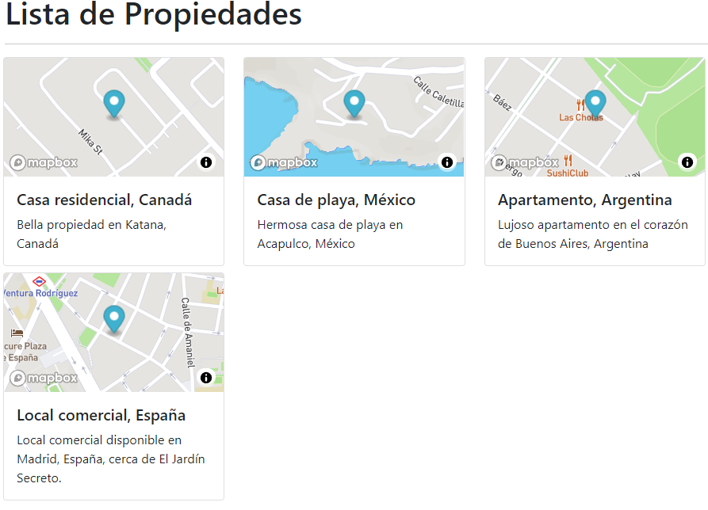

[](https://maps-appmv.netlify.app/)
# MapsApp

This project *MapsApp* was made with the purpose of putting into practice basic concepts in the development of Web sites, using Google maps/[Mapbox](https://www.mapbox.com/) API.

This project was generated with [Angular CLI](https://github.com/angular/angular-cli) version 12.1.1.

## Development server

```sh
  ng serve
```
Run `ng serve` for a dev server. Navigate to `http://localhost:4200/`. The app will automatically reload if you change any of the source files.

## Building and Running for Production

1. Install the Angular CLI

   ```sh
   npm install -g @angular/cli
   ```
2. Install dependencies

    ```sh   
   npm install
    ```

3. Run ng build

    ```sh   
   ng build
    ```

The build artifacts will be stored in the `dist/` directory.
